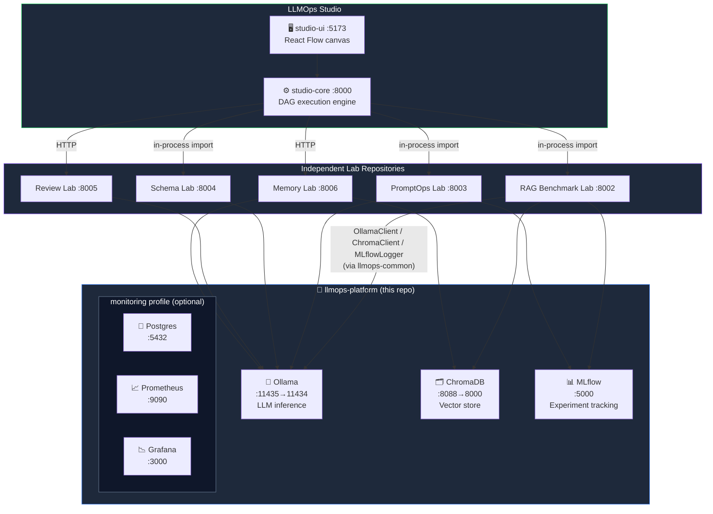
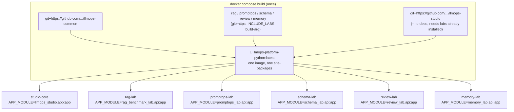

# 🧱 LLMOps Platform

**The single shared infrastructure layer for the entire LLMOps Labs ecosystem.**


---

## Recent Updates

- GPU passthrough (`deploy.resources.reservations.devices`) added to the Ollama service; ChromaDB's port standardized to `8000` across the whole ecosystem.
- `monitoring` profile makes Postgres/Prometheus/Grafana optional (saves RAM on constrained hardware).
- `studio-core` + `studio-ui` (LLMOps Studio, the DAG-based evaluation engine and its React frontend) are now first-class services in this compose file, alongside the five independent labs.
- Fixed a set of Docker build issues that previously made `docker compose up` fail or hang: broken sibling-package dependency resolution, wrong `uvicorn` entrypoints, host/container port mismatches, and a missing `.dockerignore` on the UI (was shipping a 300MB `node_modules` into every build context).
- **Removed micromamba/conda-forge entirely** from all six Python services. Every lab's `environment.yml` was installing a full conda-forge `numpy/pandas/scipy/pyarrow/faiss-cpu` stack (~2-2.5GB of BLAS/LAPACK-heavy packages) that was either completely unused (`scipy`, `faiss-cpu` — zero imports anywhere in the codebase) or a redundant duplicate of packages already correctly declared as pip dependencies in `pyproject.toml`. Every service now builds on plain `python:3.11-slim` + `pip install .`, cutting per-image size roughly in half and removing the slow conda solver step from every build.
- **Collapsed six per-service images into one shared `llmops-platform-python` image.** Building `studio-core`, `rag-lab`, `promptops-lab`, `schema-lab`, `review-lab`, and `memory-lab` as six independent Docker builds meant re-resolving and re-downloading the same heavy stack (`chromadb`, `mlflow`, `langchain`, `langgraph`) six times — ~3GB per image, none of it shared. `Dockerfile.python-services` now installs `llmops-common` + every lab + `llmops-studio` into one image via `pip install git+https://...` (no monorepo `COPY`, no local build context dependency at all), and docker-compose runs all six containers off that single built image, each started with a different `APP_MODULE` env var via `entrypoint.sh`. `studio-ui` remains its own separate image, unchanged. See [Build Architecture](#build-architecture-one-shared-python-image) below.

---

## Why this repo exists

If every laboratory in the LLMOps Labs series (RAG Benchmark, PromptOps, Schema, Review, Memory) spun up its own Ollama/Chroma/MLflow instance, running them on a single machine (in this project's case: a 4GB-VRAM GPU + 16GB RAM) would hit two unavoidable problems:

1. **VRAM contention** — two Ollama containers can't share 4GB of VRAM at once.
2. **Port/config drift** — if every lab writes its own `docker-compose.yml`, inconsistencies creep in (this project's Chroma was at one point mapped to two different ports in two different labs).

This repo removes that problem with a **single composition**: every lab and the Studio engine connect to the same Ollama, the same Chroma, the same MLflow. Each lab still lives in its own repository (for independent portfolio visibility and independent deployability) — this repo only owns the shared infrastructure and the aggregating compose file.

---

## Architecture



**Why "profiles"?** `ollama`, `chromadb`, `mlflow`, `studio-core`, `studio-ui`, and the five labs are always up (default `docker compose up`); `postgres`/`prometheus`/`grafana` only start when explicitly requested, since most local sessions don't need full observability running:

```bash
docker compose up -d                        # core services + Studio + all labs
docker compose --profile monitoring up -d   # + postgres/prometheus/grafana
```

This keeps 16GB-RAM machines from running services nobody's using in a given session.

---

## Fixed Port Contract

This table is the **single reference for the whole ecosystem** — every lab's own README and `.env.example` should match these values.

| Service | Host Port | Container Port | Purpose |
|---|---|---|---|
| Ollama | `11435` | `11434` | LLM inference (GGUF models) |
| ChromaDB | `8088` | `8000` | Vector store |
| MLflow | `5000` | `5000` | Experiment/run tracking |
| Studio Core API | `8000` | `8000` | DAG execution engine |
| Studio UI | `5173` | `80` (nginx) | React Flow canvas |
| RAG Benchmark Lab | `8002` | `8000` | Chunking/model grid search |
| PromptOps Lab | `8003` | `8000` | Prompt A/B regression |
| Schema Lab | `8004` | `8000` | Structured extraction |
| Review Lab | `8005` | `8000` | Multi-agent code review |
| Memory Lab | `8006` | `8000` | Conversational memory |
| Postgres *(optional)* | `5432` | `5432` | Structured data for Schema Lab |
| Prometheus *(optional)* | `9090` | `9090` | Metrics collection |
| Grafana *(optional)* | `3000` | `3000` | Dashboards |

> ⚠️ **Grafana vs. native Vite dev server**: Grafana's `monitoring`-profile port (`3000`) collides with `npm run dev`'s default Vite port (also `3000`) if you run both at once outside Docker. This is a known, low-priority conflict — either run the UI via Docker (port `5173`) or don't enable the `monitoring` profile while doing native frontend dev.

---

## Quick Start

```bash
git clone https://github.com/LLMOps-Studio/llmops-platform.git
cd llmops-platform
cp .env.example .env
docker compose up --build
```

This single command brings up Ollama, ChromaDB, MLflow, Studio Core + UI, and all five labs. The first build pulls and installs `llmops-common` + every lab + `llmops-studio` from GitHub **once**, into one shared image (`llmops-platform-python`) — `studio-core` and the five lab services all reuse it, so it's one heavy dependency resolution, not six. Subsequent builds are cached at the Docker layer level.

---

## Build Architecture: One Shared Python Image



`entrypoint.sh` reads `APP_MODULE` and runs `uvicorn $APP_MODULE --host 0.0.0.0 --port 8000` — that env var is the only thing that differs between the six containers below the infra level.

**Selecting which labs get built in:** `Dockerfile.python-services` takes an `INCLUDE_LABS` build-arg (comma-separated: `rag,promptops,schema,review,memory`). Trim it if you want a slimmer image for a subset of labs — just note `llmops-studio` imports all five as hard pyproject dependencies, so if `studio-core` is part of your build, `INCLUDE_LABS` needs to stay at the full set. Pin `GIT_REF` to a commit SHA instead of `main` for reproducible builds.

```bash
docker compose build \
  --build-arg GIT_REF=<commit-sha> \
  --build-arg INCLUDE_LABS="rag,promptops,schema,review,memory"
```

Verify core services are healthy:

```bash
curl http://localhost:11435/api/tags          # Ollama
curl http://localhost:8088/api/v2/heartbeat   # Chroma
curl http://localhost:5000/health             # MLflow
curl http://localhost:8000/health             # Studio Core
```

Pull a model (first-time setup):

```bash
curl http://localhost:11435/api/pull -d '{"name": "phi3:latest"}'
```

Then open `http://localhost:5173` for the Studio canvas, or hit any lab's port directly (see the table above) for its standalone API.

---

## Extension Points

| Need | What changes |
|---|---|
| Move to Kubernetes | Replace `docker-compose.yml` with `k3s` manifests — service topology stays the same |
| Add a monitoring tool | Add it to the `monitoring` profile; network topology is unaffected |
| Multi-GPU / remote inference | Change the `OLLAMA_HOST` env var — every lab picks up the new address automatically |

---

## Roadmap

- [ ] Self-hosted Langfuse (Review Lab only, optional profile)
- [ ] `make up` / `make up-monitoring` / `make down` shortcuts (Makefile exists, needs documenting)
- [ ] Commit Grafana dashboards to the repo as JSON once Schema Lab's metrics are finalized